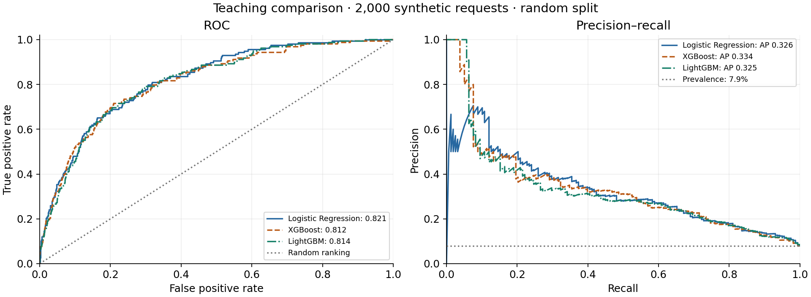
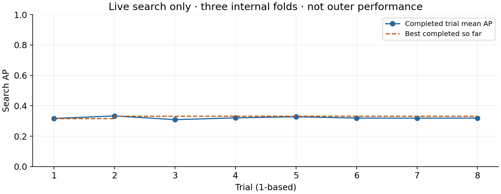

<!-- BILINGUAL:EN -->

# Tamweel Lite — Financing Default Risk

An educational machine learning project for estimating the probability
of default within 90 days after a financing application, using information
available at application time.

**Course:** SDA-DSC-211 — Advanced Machine Learning Methods  
**Project type:** Individual learner project  
**Current stage:** Days 1–2 completed; Day 3 planned  
**Day 1 initial candidate:** XGBoost, provisional; Day 2 evaluates LightGBM protocols

> This project uses synthetic course data. It must not be used to make
> real financing decisions. This is a learner repository, not an official
> SDAIA repository.

[Executed Day 1 notebook](notebooks/01_baseline_boosting.ipynb) ·
[Model comparison](artifacts/day1_model_comparison.csv) ·
[Written decision](artifacts/day1_reflection.json)

## Quick Navigation | التنقل السريع

- [Day 1 notebook | دفتر اليوم الأول](notebooks/01_baseline_boosting.ipynb)
- [Day 2 notebook | دفتر اليوم الثاني](notebooks/02_validation_tuning.ipynb)
- [Day 2 results | نتائج اليوم الثاني](artifacts/validation_summary.csv)
- [Day 2 reflection | تفسير اليوم الثاني](artifacts/day2_reflection.json)
- [Project progress | تقدم المشروع](#project-progress)

<!-- BILINGUAL:AR -->

مشروع تعليمي لتقدير احتمال التعثر خلال 90 يومًا باستخدام معلومات وقت تقديم الطلب.
اكتمل اليوم الأول والثاني، وبقية الأيام مخططة. البيانات اصطناعية والنتائج لا تصلح
لاتخاذ قرارات تمويل حقيقية. تُحفظ دفاتر الأيام وأدلتها في مستودع واحد، ثم يُنتج
النموذج وواجهة التنبؤ النهائية في اليوم الخامس.

## Project Overview

The project investigates whether machine learning models can estimate
90-day default risk from application-time features.

The five-day workflow progressively adds validation, decision analysis,
interpretation, calibration, and final documentation.

Day 1 establishes a reproducible baseline and compares Logistic Regression,
XGBoost, and LightGBM. The objective is to select an initial candidate
using evidence rather than model complexity or reputation.

## Project Progress

| Stage | Focus | Status |
|---|---|---|
| Readiness | Environment and data checks | Completed |
| Day 1 | Baseline and boosting comparison | Completed |
| Day 2 | Customer-aware and time-aware validation; tuning | Completed |
| Day 3 | Class imbalance and decision costs | Planned |
| Day 4 | Interpretation and calibration | Planned |
| Day 5 | Ensembles, Model Card, and final delivery | Planned |

## Dataset and Prediction Task

All records are synthetic.

| Item | Value |
|---|---|
| Training applications | 10,000 |
| Model predictors | 22 |
| Target | `default_within_90d` |
| Overall default prevalence | 7.89% |
| Missing feature cells | 766 |
| Prediction time | At application submission |

The target records whether a default event occurs within 90 days after
the application. It does not mean a delay of exactly 90 days.

Identifiers, dates, split-control columns, and the target are excluded
from model inputs. Challenge data is not used in the Day 1 comparison.

## Day 1 Technical Pipeline

1. Prepare the free CPU environment and verify pinned course files.
2. Load and inspect the synthetic training data.
3. Separate development, internal selection, and comparison roles.
4. Fit a Logistic Regression baseline using a preprocessing pipeline.
5. Select boosting tree counts using inner-stop log loss.
6. Refit the boosting models on all development rows.
7. Evaluate all three models on the same comparison rows.
8. Export predictions, metrics, figures, split membership, and reflection.

### Data Roles

| Role | Applications | Purpose |
|---|---:|---|
| Inner fit | 6,000 | Fit preprocessing and trees during tree-count selection |
| Inner stop | 2,000 | Select the tree count using log loss |
| Development | 8,000 | Fit or refit models after internal decisions are fixed |
| Comparison | 2,000 | Evaluate the fitted models |

Inner fit and inner stop are subsets of development, not additional data.
The comparison set is not used for early stopping or tree-count selection.

### Baseline and Boosting

The Logistic Regression baseline uses median imputation, feature scaling,
and classification in a single pipeline. Learned preprocessing values
come from development rows only.

For boosting, tree-count selection uses the internal split, followed by
refitting on all development rows.

| Model | Selected trees | Evaluated rounds |
|---|---:|---:|
| XGBoost | 61 | 91 |
| LightGBM | 41 | 71 |

Neither model reached the 300-tree search ceiling.

## Key Results — Day 1

Evaluation used 2,000 comparison applications, including 158 defaults
(7.9% prevalence).

| Model | ROC-AUC | Average Precision | Training time (s) | Selected trees |
|---|---:|---:|---:|---:|
| Logistic Regression | **0.8213** | 0.3258 | **0.0386** | Not applicable |
| XGBoost | 0.8124 | **0.3338** | 0.3610 | 61 |
| LightGBM | 0.8138 | 0.3248 | 0.2556 | 41 |

Training time includes tree-count selection and refitting for boosting,
and fitting for Logistic Regression. Download and plotting time are
excluded. These timings describe this run, not a hardware guarantee.

In this course, PR-AUC refers to scikit-learn Average Precision,
not trapezoidal integration of the precision–recall curve.

[Full comparison table](artifacts/day1_model_comparison.csv) ·
[Comparison predictions](artifacts/day1_comparison_predictions.csv)

## Initial Model-Selection Decision

XGBoost was selected as an initial candidate because it achieved the
highest Average Precision: 0.3338 versus 0.3258 for Logistic Regression.

The improvement was modest at 0.0080. Logistic Regression was faster
and achieved a higher ROC-AUC, making it a strong competing baseline.

This selection is provisional. If XGBoost's AP advantage disappears
under customer-aware and time-aware validation, Logistic Regression
may be preferred for its simplicity and faster training.

## Visual Evidence

### Learning Curves

Training loss continued to decline after inner-stop loss stopped
improving. Tree counts were selected using the internal rows only.


### ROC and Precision–Recall

The curves are close and intersect. No model dominates across all
operating points. The precision reference line represents the
comparison prevalence of 7.9%.



## Day 1 Interpretation and Limitations

- Accuracy alone is unsuitable as the headline metric: predicting
  non-default for every application would achieve approximately 92%
  accuracy while detecting no defaults.
- AP is considered alongside ROC-AUC because defaults are uncommon.
- There are 1,226 customers shared between development and comparison.
- The random split does not fully address customer overlap, temporal
  leakage, or target-maturity boundaries.
- This single split provides no confidence interval and does not
  establish general model superiority.
- These results do not establish probability calibration or operational
  financing value.
- Day 1 does not select a final approval, review, or rejection threshold.

## Day 1 Reproducibility

| Setting | Value |
|---|---|
| Runtime | Google Colab, free CPU |
| Python | 3.13.16 |
| Seed | 211 |
| CPU threads | 2 |
| Mode | `FAST_MODE=True` |
| Maximum boosting trees | 300 |
| Early-stopping patience | 30 |
| Learning rate | 0.05 |
| XGBoost depth | 3 |
| LightGBM leaves | 15 |
| LightGBM minimum child samples | 50 |

Package versions are recorded in
[environment.json](artifacts/environment.json).

Run configuration, file hashes, selection curves, and split summaries
are recorded in [day1_run.json](artifacts/day1_run.json).

### Run the Day 1 Notebook

1. Open [the executed notebook](notebooks/01_baseline_boosting.ipynb).
2. Open it in Google Colab and save a personal copy before editing.
3. Select the free CPU runtime.
4. Execute cells sequentially, waiting for each cell to finish.
5. Complete the learner reflection using the new run's evidence.
6. Run the export cell and download the evidence files.

No paid subscription, GPU, API key, or Google Drive mount is required.

If the runtime restarts, rerun the prerequisite cells in order.
Training times may change between runs; update the reflection to match
the exported comparison table.

## Day 2 — Honest Validation and Bounded Tuning

Day 2 audits information availability and evaluates later applications from
customers excluded from the corresponding training fold. All four protocols
use LightGBM; this is not a new comparison of the three Day 1 model families.
The provisional Day 1 XGBoost choice therefore remains unconfirmed.

### Leakage and Duplicate Audit

The audit excluded `days_past_due_60` and `collection_calls` from model inputs
because their information is available after application time. Identifiers,
dates and the target retain their audit/split/label roles and are not predictors.
There were 10,000 input and retained applications, zero duplicate rows removed,
and 22 eligible predictors.

### Time, Customer and Label-Maturity Boundaries

Training requires `application_date + 90 days < validation_start`.
Labels maturing exactly at the boundary are excluded. Every validation
customer is removed from that fold's training data.

| Validation period | Training rows | Validation rows | Validation defaults | Shared customers |
|---|---:|---:|---:|---:|
| July–December 2023 | 3,223 | 1,632 | 110 | 0 |
| January–June 2024 | 4,460 | 1,674 | 135 | 0 |
| July–December 2024 | 5,731 | 1,733 | 139 | 0 |

The zero-overlap guarantee applies within each fold; a customer can occur in
more than one validation period. These are related periods, not independent tests.


### Reserved Search and Frozen Settings

A separate historical cohort contains 1,935 applications and 176 defaults
(9.10%). Its latest application is dated 2023-04-01. Its labels mature before
the first outer-validation period, and it excludes all outer-validation customers.

Optuna completed eight live trials across three internal forward folds in
approximately 2.75 seconds, stopping at the trial limit. The best internal
mean AP was 0.333269. Settings were frozen before outer performance was read:

| Selected setting | Value |
|---|---:|
| `learning_rate` | 0.08530488562858765 |
| `num_leaves` | 31 |
| `min_child_samples` | 40 |

Internal early stopping uses inner-stop log loss to select tree count;
preprocessing and trees are learned on inner-fit rows first, followed by
refitting on the complete fold-training rows. Outer validation does not select
imputation, tree counts or hyperparameters. The internal search AP is a
selection statistic, not an estimate of outer or future performance.



### Day 2 Results and Interpretation

Values below are unweighted fold means ± sample SD (`ddof=1`), not pooled
OOF metrics, confidence intervals or significance tests.

| Protocol | Validation rows | ROC-AUC mean ± SD | AP mean ± SD |
|---|---:|---:|---:|
| Leaky random control (unsafe) | 10,000 | 0.9999 ± 0.0002 | 0.9988 ± 0.0014 |
| Clean random control (unsafe) | 10,000 | 0.8010 ± 0.0200 | 0.3110 ± 0.0293 |
| Honest fixed, 80 trees | 5,039 | 0.7976 ± 0.0206 | 0.3153 ± 0.0426 |
| Honest reserved search | 5,039 | 0.7855 ± 0.0232 | 0.3133 ± 0.0259 |

The leaky control deliberately uses post-outcome fields and all-row imputation.
Its AP exceeds clean random by 0.6879, demonstrating the risk of misleading
scores under that combined unsafe protocol. The clean random control still
mixes time and customers; neither random control is deployment evidence.

Clean random AP minus honest fixed AP is -0.0044: honest validation does not
necessarily produce a lower number. These protocols use different populations,
periods and training sizes, so gaps are descriptive, not isolated causal effects.

On the same outer folds, tuned AP was approximately 0.0020 below fixed AP,
and tuned ROC-AUC was also lower. AP sample SD was smaller after tuning,
but these three periods do not establish superior future stability. This run
provides no evidence that tuning improved outer mean performance; the search
was not repeated to optimize disappointing outer results. Tuned tree counts
were 24, 36 and 19, versus 80 fixed trees in each baseline fold.


### OOF Coverage and Limitations

Each honest scheme exports 5,039 live out-of-fold probabilities, covering
100% of eligible applications and 50.39% of all 10,000 rows. The 4,961 warm-up
applications have no OOF predictions and are not filled with training predictions.
Random-control predictions are not exported for later decision work.

The small search cohort and sparse positives in some internal folds limit the
search. Eight configurations do not establish a globally optimal model.
The forward folds estimate a specific later-period, unseen-customer scenario
on synthetic data. They are not an independent final test and do not establish
fairness, calibration or operational financing value.

### Run the Day 2 Notebook

1. Open [02_validation_tuning.ipynb](notebooks/02_validation_tuning.ipynb) in Colab and save a personal copy.
2. Select a fresh free-CPU session; run setup before importing libraries.
3. Execute the cells in order, inspect the audits, and retain frozen search settings.
4. Write the reflection from that run and execute the response and export cells.
5. Save the executed notebook and extract/upload actual evidence files.
6. Verify a clean `Run all` execution before final assessment.

Day 2 uses seed 211, two CPU threads, `FAST_MODE=True`, a 200-tree ceiling,
patience 20, at most eight trials, three internal search folds and a 120-second
cooperative search budget. FULL mode is optional. No paid service or Drive mount
is required. This run used live search, not precomputed recovery results.

`environment.json` is the latest exported environment record and is updated
by Day 2; day-specific configurations remain in each day's run metadata.
Course data revision: `fe0c0204e6076a7ac2139b7336485a097343fb8a`.
Day 2 support revision: `1e1da4acbee8941bef07245b259fb6c27ced4ad7`.
These course-tool revisions are not the learner's final submission commit SHA.

## Day 2 Evidence Map | أدلة اليوم الثاني

| Evidence | File |
|---|---|
| Executed notebook | [02_validation_tuning.ipynb](notebooks/02_validation_tuning.ipynb) |
| Leakage audit | [leakage_audit.csv](artifacts/leakage_audit.csv) |
| Outer-fold audit | [fold_audit.csv](artifacts/fold_audit.csv) |
| Live trial history | [optuna_results.csv](artifacts/optuna_results.csv) |
| Frozen settings and internal audits | [best_params.json](artifacts/best_params.json) |
| Per-fold validation metrics | [validation_report.csv](artifacts/validation_report.csv) |
| Fold mean and sample SD | [validation_summary.csv](artifacts/validation_summary.csv) |
| Honest OOF predictions | [day2_oof_predictions.csv](artifacts/day2_oof_predictions.csv) |
| Coverage and warm-up roles | [day2_oof_coverage.csv](artifacts/day2_oof_coverage.csv) |
| Prediction provenance | [day2_provenance.json](artifacts/day2_provenance.json) |
| Written interpretation | [day2_reflection.json](artifacts/day2_reflection.json) |
| Run metadata | [day2_run.json](artifacts/day2_run.json) |
| Fold-size figure | [day2_fold_sizes.png](artifacts/day2_fold_sizes.png) |
| Search figure | [day2_search.png](artifacts/day2_search.png) |
| Comparison figure | [day2_validation_comparison.png](artifacts/day2_validation_comparison.png) |
| Latest environment record | [environment.json](artifacts/environment.json) |

## Remaining Work and Final Submission

Days 3–5 will add decision policy, interpretation, calibration and the final
integrated model/inference interface. The Decision Card, Interpretability Report,
Ensemble Decision, Model Card and five-slide PDF must be completed from live
evidence. Final readiness requires clean notebook execution and Notebook 99
checks, consistent files/manifest, an exact final commit and immutable tag,
and private submission through the cohort's approved channel. Daily readiness
messages are not final grades or submission receipts.

## Repository Structure

```text
.
├── README.md
├── notebooks/       # Readiness and daily notebooks
├── artifacts/       # Metrics, predictions, figures, and run evidence
├── data/            # Synthetic course data and data contract
├── reports/         # Project report templates and completed reports
├── presentation/    # Presentation materials
├── submission/      # Final prediction and manifest files
├── tamweel/         # Project inference code
└── scripts/         # Setup, validation, and supporting utilities
```

## Day 1 Evidence Map

| Evidence | File |
|---|---|
| Executed notebook | [01_baseline_boosting.ipynb](notebooks/01_baseline_boosting.ipynb) |
| Model comparison | [day1_model_comparison.csv](artifacts/day1_model_comparison.csv) |
| Prediction evidence | [day1_comparison_predictions.csv](artifacts/day1_comparison_predictions.csv) |
| Split membership | [day1_split_membership.csv](artifacts/day1_split_membership.csv) |
| Learning curves | [day1_learning_curves.png](artifacts/day1_learning_curves.png) |
| ROC and precision–recall | [day1_roc_pr.png](artifacts/day1_roc_pr.png) |
| Written reflection | [day1_reflection.json](artifacts/day1_reflection.json) |
| Run metadata | [day1_run.json](artifacts/day1_run.json) |
| Environment | [environment.json](artifacts/environment.json) |

## References and Attribution

- Course: **SDA-DSC-211 — Advanced Machine Learning Methods**
- Course instructor: **Meaad Al-Marri**
- [Course template](https://github.com/almiyead-rgb/sda-dsc-211-student-template)
- [Day 1 guide](https://github.com/almiyead-rgb/sda-dsc-211-student-template/blob/main/DAY1_GUIDE.md)
- [Day 2 guide](https://github.com/almiyead-rgb/sda-dsc-211-student-template/blob/main/DAY2_GUIDE.md)
- [Administrative requirements](https://github.com/almiyead-rgb/sda-dsc-211-student-template/blob/main/ADMINISTRATIVE_REQUIREMENTS.md)
- [Technical requirements](https://github.com/almiyead-rgb/sda-dsc-211-student-template/blob/main/TECHNICAL_REQUIREMENTS.md)
- [Submission guide](https://github.com/almiyead-rgb/sda-dsc-211-student-template/blob/main/SUBMISSION_GUIDE.md)
- [Final-check guide](https://github.com/almiyead-rgb/sda-dsc-211-student-template/blob/main/FINAL_CHECK_GUIDE.md)
- [SDAIA Academy on GitHub](https://github.com/SDAIAAcademy)

The notebook and supporting code originate from the course template.
Results were produced through the learner's executed Colab run.

ChatGPT/Codex assistance was used to explain code and metrics, check
artifact consistency, and draft the reflection and README wording.
